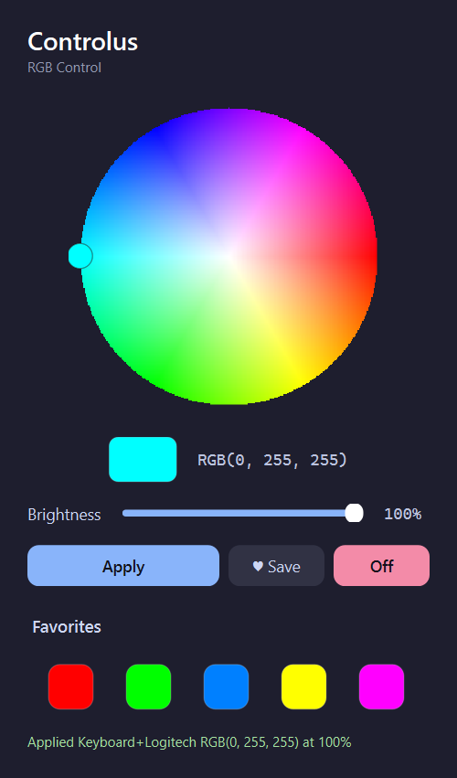

# Controlus for Windows

Windows port of [Controlus](../README.md) — a lightweight RGB controller for
**Gigabyte/AORUS keyboards** and **Logitech G Pro Wireless** mice, plus any
**OpenRGB**-supported device.

The original is a Linux GTK4/libadwaita app that talks to the keyboard through
`/dev/hidraw*` + `fcntl.ioctl`. That's Linux-only, so this port swaps in the
cross-platform [`hidapi`](https://pypi.org/project/hidapi/) library and replaces
the GUI with **PySide6 (Qt)**.



## How it talks to hardware

| Device                     | Backend                          | Cross-platform? |
|----------------------------|----------------------------------|-----------------|
| Gigabyte/AORUS keyboard    | HID feature reports via `hidapi` | rewritten for Windows |
| Logitech G Pro Wireless    | HID++ via `hidapi`               | unchanged |
| Any OpenRGB device         | OpenRGB SDK / CLI (TCP)          | unchanged |

`set_color()` fans the chosen color out to **all** connected backends, so the
keyboard and mouse stay in sync.

## Run from source

Requires Python 3.10+.

```bat
cd windows
python -m pip install -r requirements.txt
run.bat
```

(`run.bat` just calls `python main.py`.)

## Build a standalone Controlus.exe

```bat
cd windows
build.bat
```

The single-file executable is written to `dist\Controlus.exe` (~46 MB, no Python
install required to run it). Build configuration lives in `Controlus.spec`.

## Notes

- **OpenRGB devices** need the [OpenRGB](https://openrgb.org/) server running
  (Start as SDK server) before Controlus can reach them.
- Direct keyboard/mouse control via `hidapi` needs no extra service, but the
  device must not be exclusively locked by another RGB app (e.g. close
  Gigabyte RGB Fusion / Logitech G HUB if they grab the device).
- Settings (last color, brightness, favorites) are stored in
  `%APPDATA%\Controlus\config.json`.

## Project layout

```
windows/
  main.py              entry point
  controlus/
    backend.py         hidapi + OpenRGB backends
    gui.py             PySide6 GUI (color wheel, favorites, brightness)
  requirements.txt
  run.bat              run from source
  build.bat            build the .exe
  Controlus.spec       PyInstaller config
```
